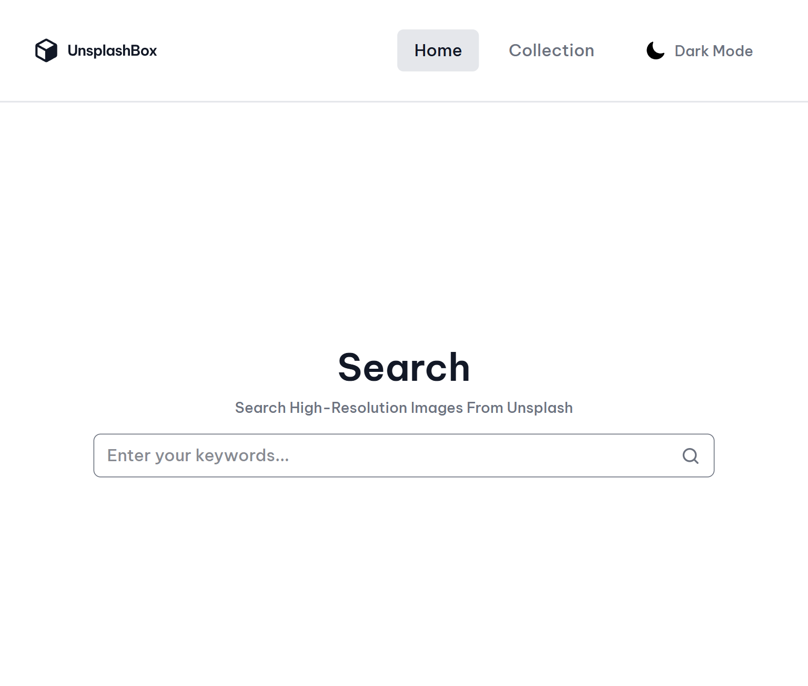
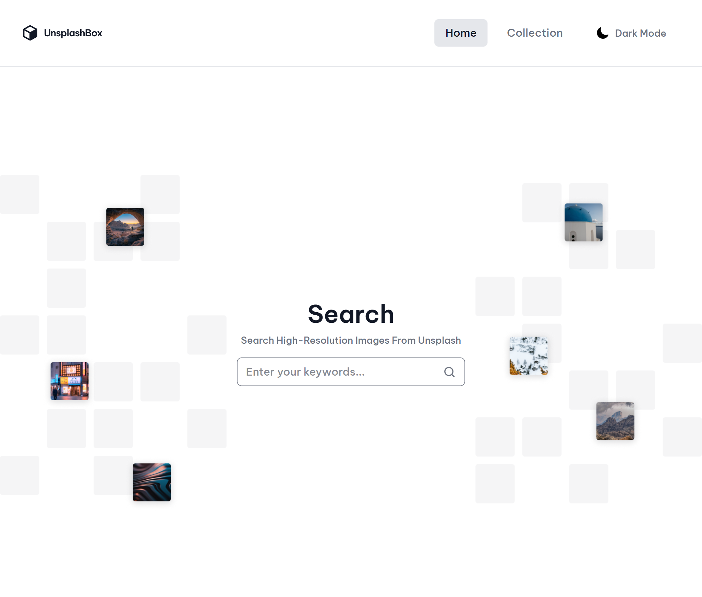

<h1 align="center">Unsplash Collection App | devChallenges</h1>

   Solution for a challenge <a href="https://devchallenges.io/challenge/unsplash-collection" target="_blank">Unsplash Collection
</a> from <a href="http://devchallenges.io" target="_blank">devChallenges.io</a>.

  <h3>
    <a href="https://luxury-horse-7b839f.netlify.app">
      Demo
    </a>
     | 
    <a href="https://github.com/Origin-B/unsplash-collection-app">
      Solution
    </a>
     | 
    <a href="https://devchallenges.io/challenge/unsplash-collection">
      Challenge
    </a>
  </h3>

## Table of Contents

- [Overview](#overview)
  - [What I learned](#what-i-learned)
  - [Useful resources](#useful-resources)
- [Built with](#built-with)
- [Features](#features)
- [Contact](#contact)
- [Acknowledgements](#acknowledgements)

## Overview

This is a photo search and collections app built on top of the **Unsplash API**. Users can search for high‑resolution photos, view details for any photo (photographer, publish date, download link), and organize favorite photos into custom collections that persist across sessions.

### What I learned

- Building a full Vite + React 19 + TypeScript project from scratch and structuring it into reusable, single‑responsibility components (`shared/`, `home/`, `collections/`, `img-details/`).
- Managing global state with the **Context API** instead of a state library — one context for collections (`CollectionsProvider`) and one for search results (`SearchResultsProvider`), each with its own persistence strategy (`localStorage` for collections since they should survive forever, `sessionStorage` for search results/term since they're only relevant for the current session).
- Working with **Tailwind CSS v4**'s new CSS-first configuration (`@theme`, `@utility`, CSS custom properties) to build a light/dark theme that's toggled by adding a class on `<html>`.
- Handling responsive, masonry-style image grids with CSS `columns` and `srcset`/`sizes` for responsive image loading.
- Building skeleton loading states to avoid layout jumps while photos are fetching.
- Using `react-router` (v7) with nested routes and a shared `Layout` for the header.

### Useful resources

- [Unsplash API Documentation](https://unsplash.com/documentation) - the source of truth for every endpoint and response shape used in this project.
- [Tailwind CSS v4 Docs](https://tailwindcss.com/docs) - needed for the new `@theme`/`@utility` CSS-first syntax used for theming and custom utilities.

### Built with

- Semantic HTML5 markup
- CSS custom properties (light/dark theme)
- CSS Grid & Flexbox
- [React 19](https://reactjs.org/)
- [TypeScript](https://www.typescriptlang.org/)
- [React Router v7](https://reactrouter.com/)
- [Tailwind CSS v4](https://tailwindcss.com/)
- [Vite](https://vitejs.dev/)
- [nanoid](https://github.com/ai/nanoid) - generating unique collection IDs
- [Unsplash API](https://unsplash.com/developers)

## Features

This application/site was created as a submission to a [DevChallenges](https://devchallenges.io/challenges-dashboard) challenge, and includes the following features:

- 🔍 Search for photos by keyword using the Unsplash API.
- 🖼️ View full details of a photo: photographer name & avatar, publish date, and a download link.
- 📁 Create custom collections and add/remove photos to/from them.
- 💾 Collections persist in `localStorage`; search results/term persist in `sessionStorage` for the browsing session.
- 🌗 Light/Dark mode toggle.
- 📱 Fully responsive layout for mobile, tablet, and desktop.
- ⏳ Skeleton loaders while photo results are loading.

## Author

- GitHub [@Origin-B](https://github.com/Origin-B)
